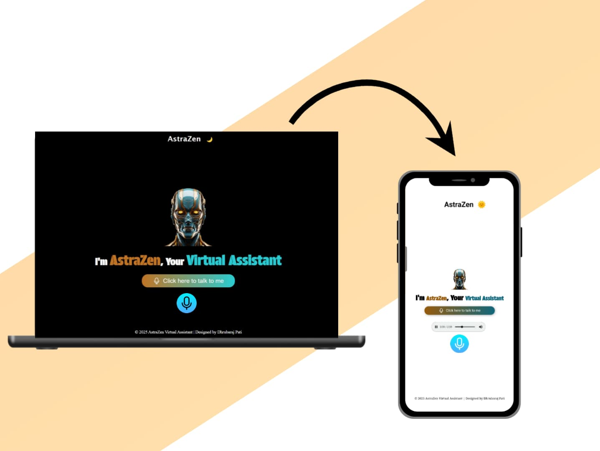

# Virtual Assistant AstraZen

**Virtual Assistant AstraZen** is a web-based voice assistant designed to provide an interactive user experience. AstraZen allows users to issue voice commands to perform various actions such as opening websites, retrieving the current time or date, and more. The assistant responds in a friendly and personalized manner.

---

## Screenshot


## Features

### 1. **Speech Recognition and Synthesis**
- Leverages Web Speech API to understand and process user voice commands.
- Provides spoken feedback using the text-to-speech feature.

### 2. **Custom Greetings**
- Dynamically greets the user based on the time of day (morning, afternoon, evening).

### 3. **Command Handling**
- Recognizes and processes specific commands:
  - "Open YouTube"
  - "Open Google"
  - "Open Facebook"
  - "Open Instagram"
  - "What time is it?"
  - "What's the date?"
  - "Who are you?"
  - "Open WhatsApp"
  - "Open Calculator"

### 4. **Interactive Interface**
- Clickable microphone button to start voice recognition.
- Animated voice feedback using `voice.gif`.
- Display of transcribed text from user commands.

### 5. **Modern Design**
- Responsive and visually appealing design.
- Styled with a professional dark theme.

---

## Technology Stack

### Frontend
- **HTML**: Provides the structure of the web page.
- **CSS**: For responsive design and styling.
  - Modern design with gradient buttons and animations.
- **JavaScript**: Adds functionality for:
  - Speech Recognition (using `SpeechRecognition` API).
  - Text-to-Speech synthesis.
  - Dynamic DOM Manipulation based on user input.

---

## File Structure

```
Virtual-Assistant-AstraZen/
├── index.html      # Main HTML file
├── style.css       # CSS for styling
├── script.js       # JavaScript for interactivity
├── Assets/         # Images and visual assets
├── Svg/            # SVG icons
└── README.md       # Project documentation
```

---

## How It Works

### 1. **Startup**
- The user clicks the microphone button to activate the assistant.
- The assistant listens for commands using the Web Speech API.

### 2. **Speech Recognition**
- The user's voice is transcribed into text.
- Commands are extracted and processed.

### 3. **Command Execution**
- The assistant performs the requested action, such as opening a website or providing the current time/date.
- If the command is unrecognized, the assistant attempts to search for relevant information online.

### 4. **Text-to-Speech**
- The assistant provides spoken responses using the `SpeechSynthesis` API.

---

## How to Run the Project

1. **Clone the repository:**
   ```bash
   git clone https://github.com/your-username/virtual-assistant-astrazen.git
   ```

2. **Navigate to the project directory:**
   ```bash
   cd virtual-assistant-astrazen
   ```

3. **Open the project in a browser:**
   - Open `index.html` directly in your browser.

4. **Use the microphone button to interact with the assistant.**

---

## Features in Detail

### **Custom Commands**
| Command             | Action                                                                 |
|---------------------|----------------------------------------------------------------------|
| "Open YouTube"      | Opens YouTube in a new browser tab.                                  |
| "Open Google"       | Opens Google in a new browser tab.                                   |
| "Open Facebook"     | Opens Facebook in a new browser tab.                                 |
| "Open Instagram"    | Opens Instagram in a new browser tab.                                |
| "What time is it?"  | Speaks the current time.                                             |
| "What's the date?"  | Speaks the current date.                                             |
| "Who are you?"      | Introduces itself as AstraZen, the virtual assistant.                |

---

## Future Improvements

1. **Persistent Theme Preference**:
   - Store the user's theme preference (light/dark) using local storage.
2. **Enhanced Command Set**:
   - Add more commands for utility functions like setting reminders or playing music.
3. **API Integration**:
   - Fetch dynamic data such as weather updates or news headlines.
4. **Error Handling**:
   - Improve handling of unrecognized commands with better suggestions.

---

## License
This project is open-source and available under the MIT License.

---

## Acknowledgments
- Inspired by advancements in AI and virtual assistant technologies.
- Built with Dhrubaraj Pati for voice-interactive web applications.

---

Feel free to fork, contribute and add new function, and share! 🎙️

